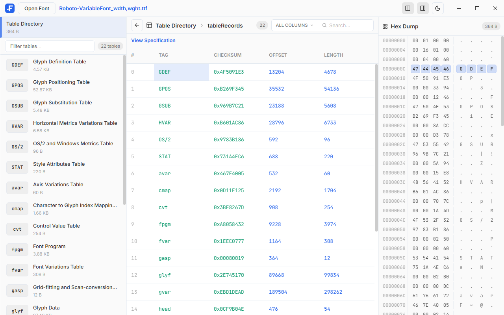

# Fontabex

OpenType font table explorer built with Tauri, Svelte, TypeScript, and Rust.



Fontabex opens local `.ttf` and `.otf` files, lists their OpenType tables, and shows parsed table data alongside the raw hex bytes. It is intended as a focused inspection tool for font internals rather than a font editor.

## Features

- Open fonts with the file picker or drag and drop.
- Browse the table directory with table tags, offsets, lengths, and sizes.
- Inspect parsed table fields with data types, offsets, lengths, values, nested arrays, and records.
- Search parsed data by index, all columns, or specific columns.
- Resize parsed-data columns (double-click the resize handle to reset).
- View raw table bytes in a synchronized hex pane.
- Click parsed fields to highlight and scroll to the corresponding byte range.
- Open links to the relevant OpenType specification pages.
- Toggle light and dark themes.

## Parsed Tables

The Rust parser currently has structured parsers for:

- Table Directory
- `cmap`
- `head`
- `hhea`
- `hmtx`
- `maxp`
- `name`
- `OS/2`
- `post`

Other tables are still listed in the directory and can be inspected through their raw bytes, but structured parsing is added table by table.

## Tech Stack

- Frontend: Svelte 5, TypeScript, Vite
- Desktop shell: Tauri 2
- Backend parser: Rust with `read-fonts` and `encoding_rs`
- Formatting: Prettier, `prettier-plugin-svelte`, and rustfmt

## Requirements

- Node.js and npm
- Rust toolchain
- Tauri system prerequisites for your platform

For platform-specific Tauri setup, see the Tauri prerequisites documentation:
https://tauri.app/start/prerequisites/

## Development

Install dependencies:

```sh
npm install
```

Run the Vite dev server:

```sh
npm run dev
```

Run the Tauri app in development:

```sh
npm run tauri dev
```

Check the Svelte and TypeScript code:

```sh
npm run check
```

Check the Rust backend:

```sh
npm run check:rust
```

Format frontend and shared web assets:

```sh
npm run format
```

Check frontend formatting:

```sh
npm run format:check
```

Format the Rust backend:

```sh
npm run format:rust
```

Check Rust formatting:

```sh
npm run format:check:rust
```

Build the frontend:

```sh
npm run build
```

Build the desktop app:

```sh
npm run tauri build
```

## Project Layout

```text
src/
  App.svelte                 Main application shell and parsed-data view
  app.css                    Global app styles and shared table styles
  components/                Reusable UI components
  lib/                       Frontend helpers and table metadata

src-tauri/
  src/lib.rs                 Tauri commands and app entry
  src/parser/                OpenType table parsers
  src/parser/data/           Static parser lookup data
```

## License

GPL-3.0-only. See [LICENSE](LICENSE).
